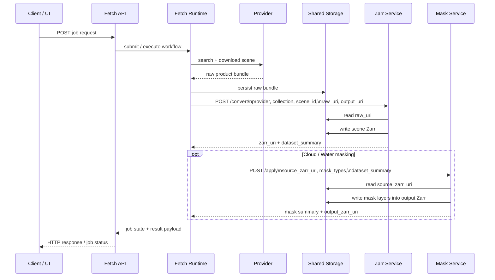

# Service Communication

This diagram shows how the main backend services communicate in the current pipeline architecture.

## High-Level Service Communication

```mermaid
flowchart LR
    User[User / UI / Client]
    API[Nimbus Fetch API\nnimbuschain_fetch_service]
    Fetcher[Nimbus Fetch Runtime\nnimbuschain_fetch]
    Providers[External Providers\nCopernicus / USGS]
    ZarrSvc[Nimbus Zarr Service\nnimbuschain_zarr_service]
    MaskSvc[Nimbus Mask Service\nnimbuschain_mask_service]
    Shared[(Shared Storage / Artifacts)\nraw bundles, zarr stores, masks]
    Contracts[nimbuschain_shared\ncontracts + clients + shared conventions]

    User -->|HTTP| API
    API -->|application services / job orchestration| Fetcher

    Fetcher -->|provider SDK / HTTP / auth| Providers
    Providers -->|raw products| Fetcher
    Fetcher -->|write raw bundle URI / artifact metadata| Shared

    Fetcher -->|HTTP /convert\nConvertRequest| ZarrSvc
    ZarrSvc -->|read raw_uri| Shared
    ZarrSvc -->|write zarr_uri + dataset summary| Shared
    ZarrSvc -->|ConvertResponse| Fetcher

    Fetcher -->|HTTP /apply\nMaskApplyRequest| MaskSvc
    MaskSvc -->|read source_zarr_uri| Shared
    MaskSvc -->|write cloud/water mask layers| Shared
    MaskSvc -->|Mask result payload| Fetcher

    API -. uses .-> Contracts
    Fetcher -. uses .-> Contracts
    ZarrSvc -. uses .-> Contracts
    MaskSvc -. uses .-> Contracts
```

## Request / Artifact Flow



## Notes

- Services communicate primarily through **HTTP APIs**.
- They exchange **typed shared contracts** from `nimbuschain_shared`.
- Large data is usually not passed inline between services.
- Instead, services exchange **references** such as:
  - `raw_uri`
  - `output_uri`
  - `zarr_uri`
  - `source_zarr_uri`
  - `job_id`
  - `scene_id`
- Shared storage is the handoff point for raw bundles, converted Zarr stores, and mask outputs.
